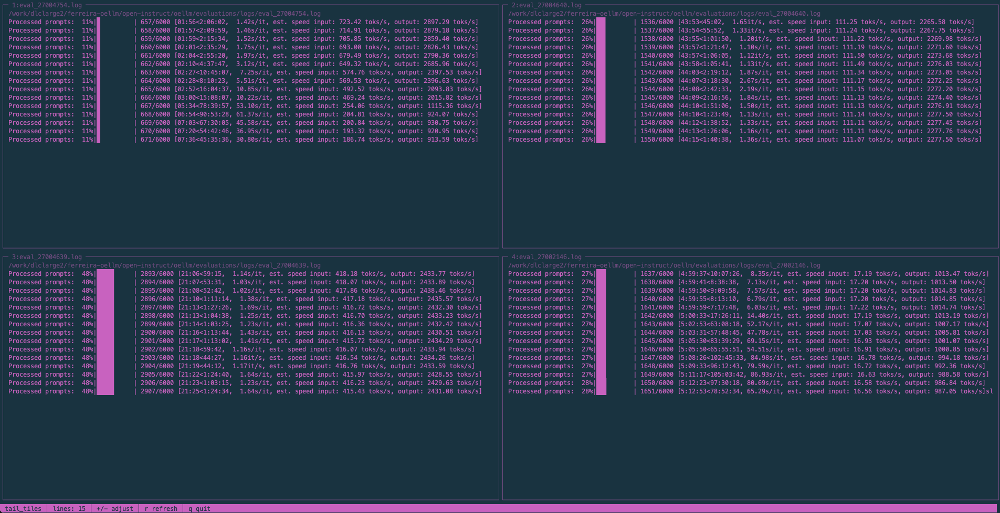

# Tail-Tiles



> Multi-tile tail viewer for terminal in <200 lines of code

A minimal, dependency-free (except for tail) Python tool to monitor multiple log files simultaneously in a single terminal window. Like `tail -f`, but for up to 4 files at once in a clean tiled layout with a small session manager in under 200 lines of code. Created with Claude Code (Opus 4.5).

## Quick start

**From PyPI:**
```bash
pip install tail-tiles
tail-tiles
```

**From source:**
```bash
git clone https://github.com/ferreirafabio/tail_tiles.git
cd tail_tiles
python -m tail_tiles
```

That's it. The interactive menu guides you through selecting a layout and file paths.

## Session restore

tail_tiles remembers your last 3 sessions. On startup, quickly restore any previous session:

```
  tail_tiles - Multi-file tail viewer

  Recent sessions:
    1) 2 file(s), 10 lines
       • /var/log/syslog
       • /var/log/auth.log
    2) 4 file(s), 15 lines
       • ~/app/logs/error.log
       • ~/app/logs/access.log
       • ~/app/logs/debug.log
       • ~/app/logs/info.log
    n) New session

  Select [1/2/n]: 1

  Restoring session...
```

Sessions are stored in `~/.config/tail_tiles/sessions.json`.

## Layout selection

Start a new session and pick a layout:

```
  Select layout:

    1) Single        2) Vertical      3) Horizontal    4) Grid
       ┌─────┐          ┌──┬──┐          ┌─────┐          ┌──┬──┐
       │     │          │  │  │          │  1  │          │ 1│ 2│
       │  1  │          │ 1│ 2│          ├─────┤          ├──┼──┤
       │     │          │  │  │          │  2  │          │ 3│ 4│
       └─────┘          └──┴──┘          └─────┘          └──┴──┘

  Layout [1-4]: 4

  Enter 4 file path(s):

    [1] /var/log/syslog
    [2] /var/log/auth.log
    [3] ~/app/logs/error.log
    [4] ~/app/logs/access.log

  Lines to show [10]: 15

  Starting with 4 file(s), 15 lines each...
```

## Controls

| Key | Action |
|-----|--------|
| `+` / `=` | Show more lines |
| `-` / `_` | Show fewer lines |
| `r` | Force refresh |
| `q` | Quit |

## Features

- **Zero dependencies** - Uses only Python 3.10+ standard library (curses, readline)
- **Session history** - Saves and restores last 3 sessions
- **Tab completion** - Auto-complete file paths when entering
- **Live updates** - Polls files for changes (100ms interval)
- **Flexible layouts** - Single, vertical split, horizontal split, or 2×2 grid
- **Terminal resizing** - Automatically adapts to window size changes
- **Clean UI** - Minimalistic curses interface with unicode box-drawing

## Running without install

```bash
python -m tail_tiles
```

## Tests

```bash
pip install -e ".[dev]"
python -m pytest tests/ -v
```

## File structure

```
.
├── LICENSE
├── README.md
├── pyproject.toml
├── tail_tiles
│   ├── __init__.py         # Package exports
│   └── __main__.py         # All the code (~185 lines)
└── tests
    ├── __init__.py
    └── test_tail_tiles.py  # 15 tests
```

## Requirements

- Python 3.10+
- Linux or macOS (curses is not available on Windows)

## License

MIT
